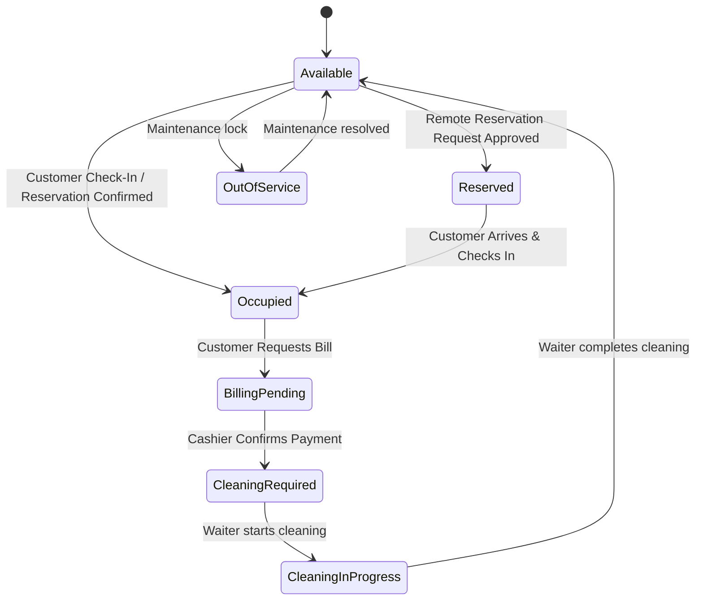

# Smart Restaurant Operating System (SROS) - Product Requirements Document (PRD)

**Version:** 1.1  
**Refined By:** Antigravity (AI Architect)  
**Status:** Approved for Implementation  
**Project Scope:** Enterprise Restaurant Seating, Ordering, Real-Time Kitchen Coordination, and AI-Assisted Operations.

---

## 1. Executive Summary
SROS is a digitized ecosystem connecting customers, waiters, kitchen cooks, cashier billing staff, and management under a unified, real-time reactive workspace. The primary goal is reducing preparation delays, preventing order errors, enforcing operational hygiene, and tracking loyalty metrics.

---

## 2. Authentication & Access Gates
Instead of generic dashboard switching, SROS requires a **separated entrance** with role identification:

### A. Role Gates
1. **Customer**: Check-in requires selecting Table Number (1–6), Seat Number (1–4), Guest Name, and Mobile Number.
2. **Staff Portals**: Access requires selecting the role and entering a secure 4-digit PIN:
   - **Waiter**: PIN `1111`
   - **Sabji Cook**: PIN `2222`
   - **Roti Cook**: PIN `3333`
   - **Billing/Cashier**: PIN `4444`
   - **Restaurant Manager**: PIN `8888`
   - **Owner/Admin**: PIN `5555`

### B. Session Isolation
Authenticated users see *only* their specific dashboard. A "Logout" control clears the session and returns the interface to the main role selection screen.

---

## 3. Table Seating & Cleaning Lifecycles
To maintain strict hygiene standards, tables transition through a formal state machine. Check-ins are blocked during cleaning.

### Business Rules:
- **Cleanliness Enforcement**: Tables in `CLEANING_REQUIRED`, `CLEANING_IN_PROGRESS`, or `OUT_OF_SERVICE` reject customer check-ins and remote reservations.
- **Waiter Role Override**: Waiters and Managers are the only roles permitted to advance a table from `CLEANING_REQUIRED` $\rightarrow$ `CLEANING_IN_PROGRESS` $\rightarrow$ `AVAILABLE`.

---

## 4. Seating & Member Management
Tables support multiple guests dining together.
- **Seats Mapping**: Each table is configured with 4 seats.
- **Waiter Management**: Waiters can open the Table Inspector, view a grid of Seats 1–4, and dynamically type in/update the member names and mobile numbers.
- **Seat-Item Binding**: Order items added to the cart are tagged with the specific Seat Number (1–4) of the guest who ordered them.
- **Split Billing**: At checkout, the cashier can choose to:
  - **Combined Invoice**: Single bill for all table items.
  - **Split Invoice by Seat**: Subtotals, 18% GST, and final totals calculated separately for each seat based on their item bindings.

---

## 5. Item-Level Partial Cancellations & Kitchen Locking
Orders contain multiple dishes, and customers must be able to cancel specific dishes without discarding the entire order. Furthermore, kitchen operations must lock cancellation once preparation starts to prevent food wastage.

### Lifecycle of an OrderItem:
`PENDING` (Pending/Accepted) $\rightarrow$ `IN_PROGRESS` (Preparing/Cooking) $\rightarrow$ `READY` (Ready for pickup/delivery)

### Business Rules:
- **Partial Item Cancel**: Customers see a list of their ordered items on their active tracker screen. Each item has an individual "Cancel" button.
- **Kitchen Locking Rule**: When a cook clicks **Accept & Start Prep** or **Start Cooking** on a kitchen ticket, the item status changes to `IN_PROGRESS` in the database.
- **Cancellation Enforcement**:
  - If item status is `PENDING`, cancellation is **ALLOWED**. Clicking cancel deletes the `OrderItem` from the database.
  - If item status is `IN_PROGRESS` or `READY`, cancellation is **RESTRICTED**. The button is disabled, showing a locked badge. If a REST request is sent directly, the backend returns a `400 Bad Request` with an error message: *"Cancellation blocked: Kitchen has started preparing this item."*
- **Empty Order Resolution**: If all items in an order are cancelled, the parent `Order` is automatically cleaned up and deleted from the database.

---

## 6. AI Kitchen Assistant
Exposes predictive intelligence:
1. **Preparation Predictions**: Aggregates the ingredients of all items currently in the active kitchen queue, applies day-of-week and time-of-day multipliers, and outputs preparation suggestions (e.g. "Chopped Onions: 3.5kg").
2. **Rush Hour Forecasting**: Predicts low/medium/high traffic alerts based on the time and day.
3. **Estimation Times**: Predicts cooking and delivery completion durations based on active queue size and priority flags.
